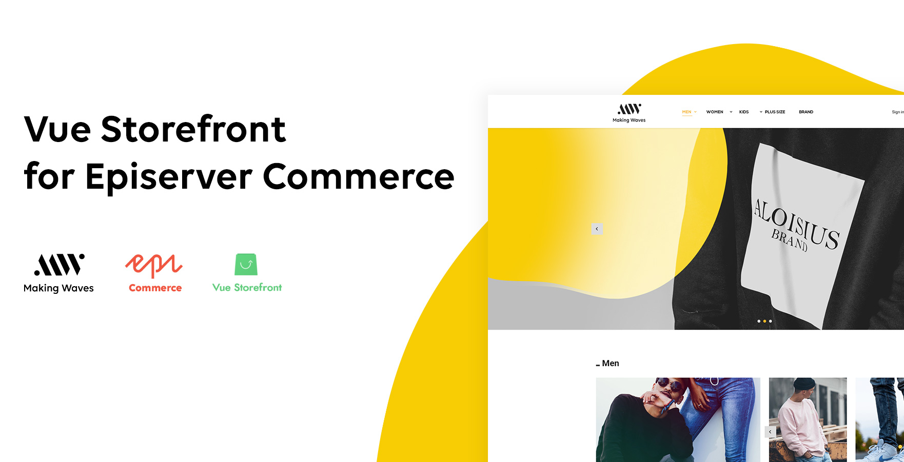
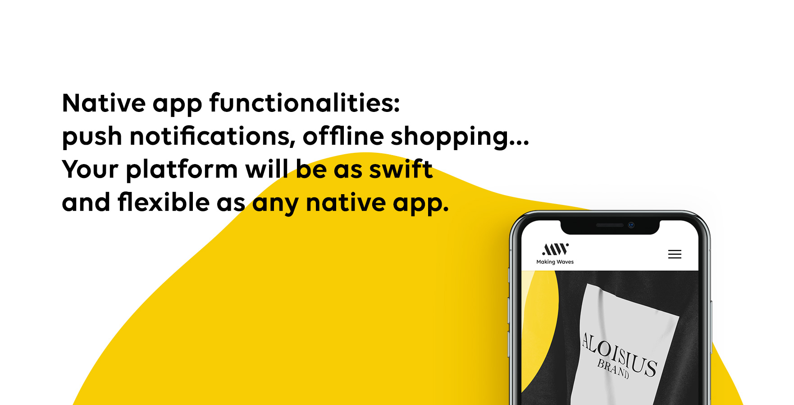
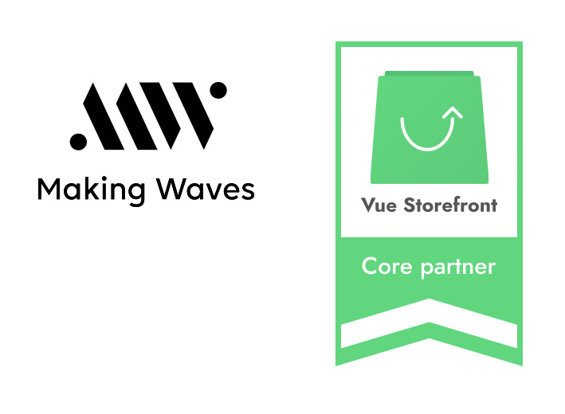

# Vue Storefront for EPiServer Commerce 



Vue Storefront is one of the most complete PWAs (Progressive Web Applications) for e-commerce platforms on the market. It transforms any commerce platform into a smooth and pleasant experience. 

This project allows you to seamlessly integrate the [Vue Storefront](https://www.vuestorefront.io/ "Vue Storefront") with [EPiServer Commerce](https://www.episerver.com/products/episerver-commerce/ "Episerver Commerce"). You can now combine the best of both worlds: the solid technological backbone of an e-commerce platform and the smooth user experience of a native application. The connector that was developed by Making Waves, is a piece of the open-source code that easily connects Vue Storefront and EPiServer Commerce to create one integrated e-commerce experience.

### Features
We have integrated VSF and Episerver to create a solid baseline for mobile e-commerce platform and have included the following set of features: 
-	Registration and login
- Product list, browsing products
- Product details
- Products comparison
- Shopping cart and checkout process
- Order placing and history
- Payments (eg.: PayPal)
- Search and product catalogue
- Coupon and discount functionalities


## Benefits


Setting up your e-commerce platform with the connector of Making Waves has a number of advantages:
-	Reduced cost & short time to launch: We don’t start from scratch. We have the key components available to have a platform up and running in no time.
- Reliability: We build e-commerce platforms with a professional back-office platform (EPiServer Commerce) and open-source components with several previous implementations.
-	Great user experience: Very fast interface thanks to the data and code that is cached and saved locally, even during high traffic. 
-	Easily scalable: We can easily and quickly add other functionalities from EPiServer. We can also enhance the open-source components, as some were built by our team.
-	Native app functionalities: Push notifications, offline shopping,… Your platform will be as swift and flexible as any native app. 
-	Open-source: No license cost and the support of a reliable community of developers who constantly use, test and optimise the product.


## How to start?
This project is based on the [Episerver Commerce Quicksilver sample e-comerce site](https://github.com/episerver/Quicksilver).

In order to run this demo you'll have to install and run the following components:
1. Install Vue Storefront depending on your development environment: [Windows Installation](https://docs.vuestorefront.io/guide/installation/windows.html) or [Linux Installation](https://docs.vuestorefront.io/guide/installation/linux-mac.html)
2. Clone this repository and install Quicksilver demo - see [How to run Quicksilver project](https://github.com/makingwaves/epi-commerce-to-vue-storefront/tree/master/Quicksilver)

    ``` git clone https://github.com/makingwaves/epi-commerce-to-vue-storefront.git```

3. You can also clone the [Quicksilver project](https://github.com/makingwaves/epi-commerce-to-vue-storefront/tree/master/Quicksilver)  directly and then follow the instructions on [how to apply changes to Quicksilver project](README-TECH.md)


Vue Storefront integration pattern always consist two parts:

1. **ApiBridge** - implements web api required by VSF
2. **DataExporter** - reading, converting and exporting data models from EpiServer to Elasticsearch (where it can be accessed by VSF)


#### How to export Quicksilver catalog content to VSF.

Before exporting make sure that:
- VSF (vsf and vsf-api) is up and running
- Quicksilver page is up and running

Navigate to **EPiServer CMS Admin panel -> Scheduled Jobs -> Export to Vue Storefront** and start the job manually.

When the job has finished, refresh the VSF application to verify that all the products are visible.

## See it in action

<table style="border:0">
  <tbody>
    <tr>
      <td align="center" valign="middle">
        <a href="mailto:grzegorz.kalucki@makingwaves.com">
            
        </a>
      </td>
      <td align="left" valign="top">
      Are you interested in learning more about Vue Storefront & EpiServer Commerce intergation or testing our demo site? 
      <br/><br/>
        <a href="mailto:grzegorz.kalucki@makingwaves.com">Contact us</a> and we'll be more than happy to have an online call to tell you more details or present our demo solution with all features available.
      </td>
    </tr>
  </tbody>
</table>

## About Making Waves


     
[**Making Waves**](https://makingwaves.com) is a trusted technology partner that combines the skills and strengths of a creative software house, a digital agency and a content editing business.

We create digital consumer products and platforms with a strong emphasis on design, user experience and software quality. We cover web, mobile, and desktop applications. We also provide content for corporate websites, blogs, product pages and catalogues in 13 different languages.

The Krakow office of [**Making Waves**](https://makingwaves.com) specialises in multichannel ecosystems for e-commerce. We are a Core Partner of Vue Storefront.
 
If you have any questions, please don’t hesitate to [contact us](mailto:grzegorz.kalucki@makingwaves.com)

