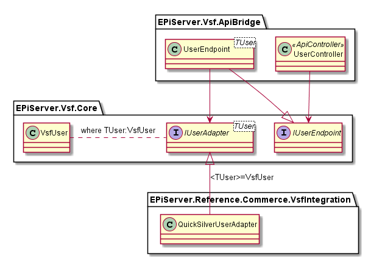

# EPiServer.Vsf.ApiBridge
This project provides the implementation for VSF api bridge. 
VSF api descritpion can be found [HERE](https://github.com/DivanteLtd/vue-storefront-integration-boilerplate/blob/master/1.%20Expose%20the%20API%20endpoints%20required%20by%20VS/Required%20API%20specification.md#dynamic-requests-for-vue-storefront-api)
## Folders structure
    .
    +-- Authorization
    |   +-- Claims
    |   +-- Token
    +-- Controllers
    +-- Endpoints
    +-- Utils

## Authentication
<b>JwtBearerAuthentication</b> middleware is used with custom token provider (VsfJwtBearerTokenProvider).  
<b>VsfJwtBearerTokenProvider</b> class is able to extract Jwt token not only from Authorization header, but also from query string.  
<b>JwtUserTokenProvider</b> class is responsible for generating access and refresh tokens. 

More information about VSF authentication can be found 
[HERE](https://github.com/DivanteLtd/vue-storefront-integration-boilerplate/blob/master/1.%20Expose%20the%20API%20endpoints%20required%20by%20VS/Required%20API%20specification.md#post-vsbridgeuserlogin)

## Api status
<b>POST /vsbridge/cart/create</b> - implemented 
<b>GET /vsbridge/cart/pull</b> - implemented 
<b>POST /vsbridge/cart/update</b> - implemented 
<b>POST /vsbridge/cart/delete</b> - implemented 
<b>POST /vsbridge/cart/apply-coupon</b> - implemented (further testing needed) 
<b>POST /vsbridge/cart/delete-coupon</b> - implemented (further testing needed) 
<b>GET /vsbridge/cart/coupon</b> - implemented (further testing needed) 
<b>GET /vsbridge/cart/totals</b> - implemented (further testing needed) 
<b>GET /vsbridge/cart/payment-methods</b> - implemented (further testing needed) 
<b>POST /vsbridge/cart/shipping-methods</b> - implemented (further testing needed) 
<b>POST /vsbridge/cart/shipping-information</b> - MOCKED 
<b>POST /vsbridge/cart/collect-totals</b> - implemented (further testing needed) 

<b>POST /vsbridge/user/create</b> - implemented 
<b>POST /vsbridge/user/login</b> - implemented 
<b>POST /vsbridge/user/refresh</b> - implemented 
<b>POST /vsbridge/user/resetPassword</b> - implemented 
<b>POST /vsbridge/user/changePassword</b> - implemented 
<b>GET /vsbridge/user/order-history</b> - MOCKED 
<b>GET /vsbridge/user/me</b> - implemented 
<b>POST /vsbridge/user/me</b> - implemented 

<b>GET /vsbridge/stock/check/:sku</b> - partially implemented 

<b>POST /vsbridge/order/create</b> - NOT IMPLEMENTED 

## Overall class design

## Todo
1. <b>RefreshTokenRepository</b> - Currently there is only one class that implements <b>IRefreshTokenRepository</b> interface, and it is <b>MemoryRefreshTokenRepository</b>. 
2. <b>StockAdapter</b> - <b>QuickSilverStockAdapter</b> is not fully implemented. The returned <b>VsfStockCheck</b> object is in grate part mocked.
3. <b>UserEndpoint.OrderHistory</b> - /vsbridge/user/order-history api is mocked.
4. <b>CartEndpoint.ShippingInformation</b> - is mocked.
5. <b>OrderApi</b> - not implemented
6. I pewnie jeszcze wiecej :D